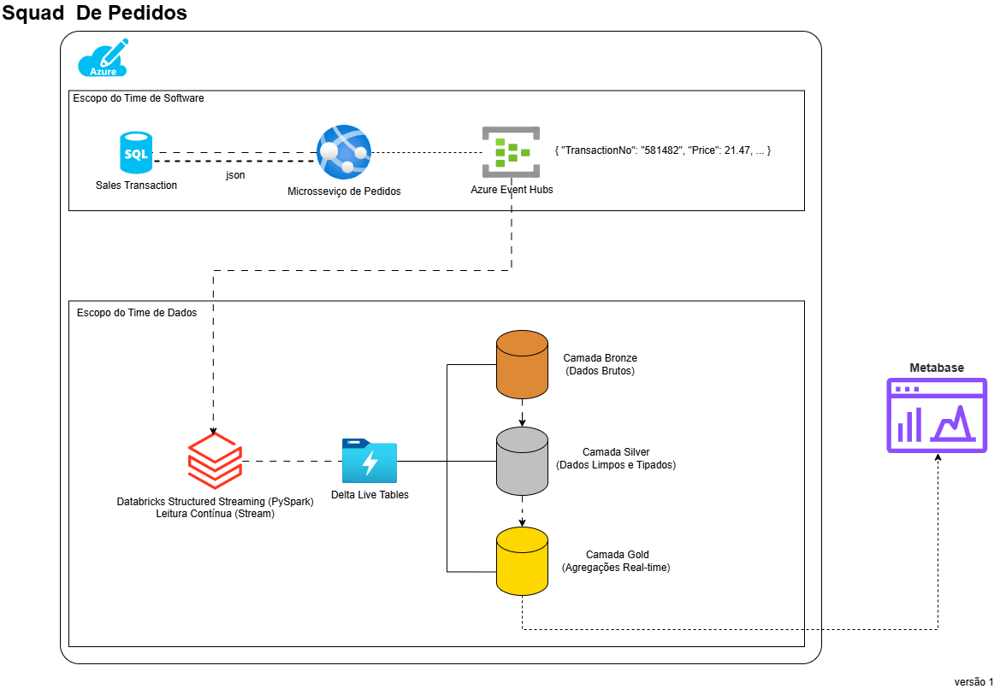

# Pipeline de Dados Real-Time (Squad de Pedidos)



1. Arquitetura Proposta e Fluxo de Dados

Para unir o mundo transacional (Engenharia de Software) ao analítico (Engenharia de Dados) sem gerar gargalos no banco de produção, utilizaremos o padrão Event-Driven Architecture (Arquitetura Orientada a Eventos) com CDC (Change Data Capture) ou ingestão direta via mensageria.

Como a infraestrutura atual já utiliza Azure e Azure Databricks, a extensão natural e de alta performance para o mundo real-time é a seguinte arquitetura:

### Componentes da Solução:

Transacional: Aplicação envia os dados de pedidos para o banco transacional (neste caso o csv do kaggle).

Mensageria (Ingestão): Azure Event Hubs (com compatibilidade para API do Kafka). Atuará como o buffer de eventos em tempo real.

Processamento (Dados): Databricks Structured Streaming consumindo o Event Hubs em tempo real.

Armazenamento (Lakehouse): Delta Lake organizado nas camadas Bronze (Raw/Append-only), Silver (Deduplicada/Clean) e Gold (Agregada/Negócio), governado pelo Unity Catalog.

2. Justificativa Técnica (Motivadores da Escolha)

Azure Event Hubs: Possui integração nativa com o ecossistema Azure, escalabilidade sob demanda e fornece um endpoint compatível com Kafka, permitindo que os engenheiros de software utilizem bibliotecas padrão de mercado.

Databricks Structured Streaming: Permite reaproveitar a engine do Spark que o time de dados já conhece, tratando dados em tempo real (streaming) com a mesma simplicidade de dados em lote (batch).

Delta Lake (ACID nas tabelas): Essencial para real-time que garante que leituras analíticas não travem as escritas constantes, além de suportar operações de MERGE (Upsert).

3. Alinhamento com o time de Software

O time de engenharia de software será responsável por garantir que cada evento de pedido gerado no sistema transacional seja publicado no Azure Event Hubs.

### Exemplo de Código para Engenharia de Software (Python)

Este trecho simula o microsserviço de pedidos postando uma venda no Event Hubs.

```python
    logger.info(f"Iniciando leitura e streaming do arquivo: {file_path}")
    
    try:
        with open(file_path, mode='r', encoding='utf-8') as file:
            reader = csv.DictReader(file)
            
            for count, row in enumerate(reader, start=1):
                payload = parse_and_format_row(row)
                
                # Transforma o dicionário/modelo em JSON
                event_data_batch = client.create_batch()
                json_string = json.dumps(payload)
                event_data_batch.add(EventData(json_string))
                
                # Envia o evento de forma assíncrona/real-time
                client.send_batch(event_data_batch)
                
                # Log estruturado a cada 100 eventos para não saturar o console, mantendo rastreabilidade
                if count % 100 == 0 or count == 1:
                    logger.info(f"Status do Pipeline: {count} eventos enviados com sucesso até o momento.")
                    
    except EventHubError as eh_err:
        logger.error(f"Erro crítico na comunicação com o Azure Event Hubs: {eh_err}")

    except Exception as err:
        logger.error(f"Erro inesperado durante o processamento do stream: {err}")
```

4. Implementação na Engenharia de Dados (Databricks)

O engenheiro de dados criará um Job estruturado (ou pipeline via Delta Live Tables) que rodará continuamente limpando e estruturando os dados do Event Hubs até a camada Silver.

### Exemplo de Código para Engenharia de Dados (PySpark / Structured Streaming)

```python
df_orders_parsed = df_bronze \
    .withColumn("body_string", col("body").cast("string")) \
    .withColumn("parsed_data", from_json(col("body_string"), order_schema)) \
    .select("parsed_data.*", "enqueuedTime")

# TRANSFORMAÇÃO & LIMPEZA
# Exemplo: Calculando o valor total da transação e convertendo tipos de data
df_silver = df_orders_parsed \
    .withColumn("TotalPrice", col("Price") * col("Quantity")) \
    .withColumn("EventTimestamp", col("Date").cast("timestamp")) \
    .drop("Date")
```

